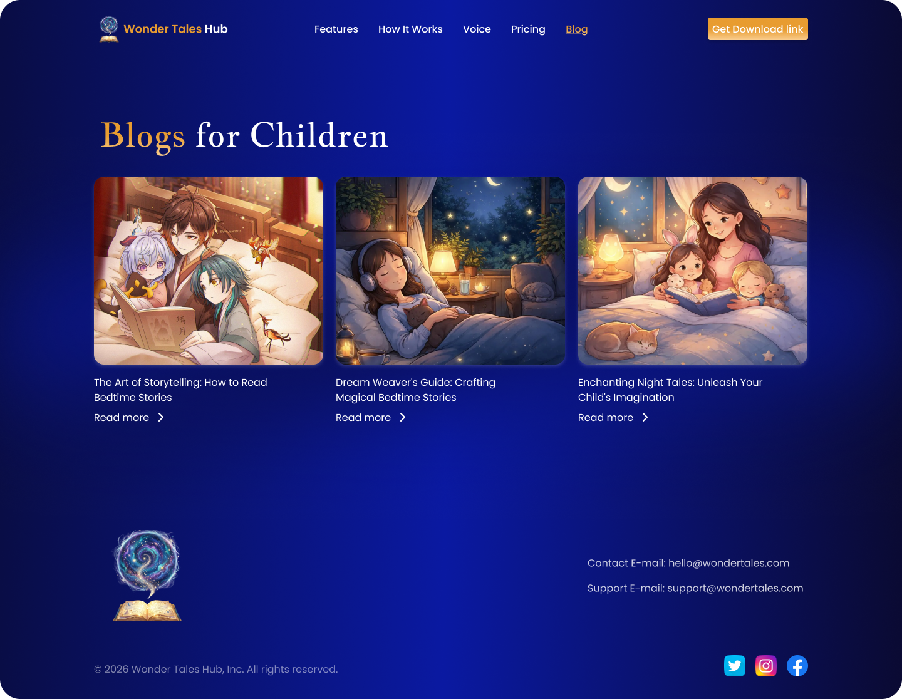

# Screenshots & Demo

## Landing Page

## Blog Section

## Blog Detail

## Features

### AI Story Generation
- Personalized stories based on child's profile
- Multiple theme options
- Real-time generation with progress indicator

### Voice Narration
- Professional voice narration
- Word-level highlighting during playback
- Download audio files

### User Dashboard
- View all created stories
- Manage children profiles
- Access favorites and history

### Admin Panel
- User management
- Content moderation
- Analytics and reports
- System settings

## Demo Video
Coming soon...

## Live Demo
Visit: [Demo Link] (Coming soon)

## UI Design Files
Full design documentation available in `landingpage/ui/` directory:
- Landing Page mockups
- Blog layouts
- Component designs
- Design system PDF

## Mobile Responsive
All pages are fully responsive and optimized for:
- Mobile phones (320px+)
- Tablets (768px+)
- Desktops (1024px+)
- Large screens (1920px+)
